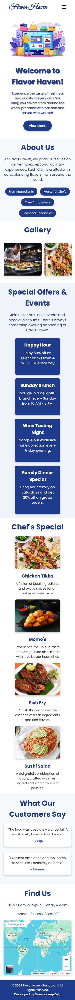
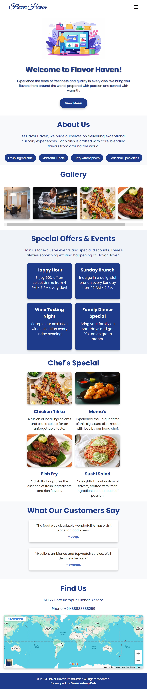

# Flavor Haven

Welcome to **Flavor Haven**, a visually engaging static website for a restaurant that offers a delightful dining experience with a variety of global flavors. This project includes an HTML structure with a corresponding CSS file to style the elements and enhance the aesthetic appeal.

## Website Link

You can view the live website [here](https://swarnadeepdeb.github.io/Flavor-Haven/).


## Screenshots

### Desktop View
- **Home Page**  
  

### Mobile View
- **Home Page**  
  

### Tablet View
- **Home Page**  
  

## Project Structure

The project consists of the following files and folders:

```
- images/          # Contains all images used in the gallery, chef's specials, and various sections
- index.html       # Main HTML file for the website structure and content
- style.css        # CSS file for styling and layout
```

## Sections in the Website

1. **Navbar**: 
   - A navigation bar at the top with links to various sections of the page, including Home, About, Gallery, Specials, Chef's Picks, and Contact.

2. **Hero Section**:
   - Features an inviting message with a call-to-action button leading users to the menu.

3. **Introduction Section**:
   - Describes the restaurant's values and unique aspects, such as fresh ingredients and a cozy atmosphere.

4. **Gallery Section**:
   - Displays a carousel of images showcasing the restaurant, ambiance, and dishes.

5. **Specials and Events Section**:
   - Highlights current offers, events, and special promotions.

6. **Chef's Specials Section**:
   - Showcases the signature dishes of the restaurant with images and descriptions.

7. **Testimonials Section**:
   - Displays feedback from customers to build trust and highlight the quality of service.

8. **Contact & Map Section**:
   - Contains address and contact information, as well as an embedded Google Map for easy navigation.

9. **Footer**:
   - Includes copyright information and a link to the developer’s GitHub profile.

## Technologies Used

- **HTML**: Structure of the website.
- **CSS**: Styling and layout.
- **Google Fonts**: Fonts for a modern look, including "Poppins" for main text and "Great Vibes" for a touch of elegance.
- **Google Maps Embed**: Embedded map to show the restaurant’s location.

## How to Use

1. Download or clone this repository.
2. Open the `index.html` file in any web browser.
3. Navigate through the website using the menu links.

## License

This project is licensed under the MIT License.
